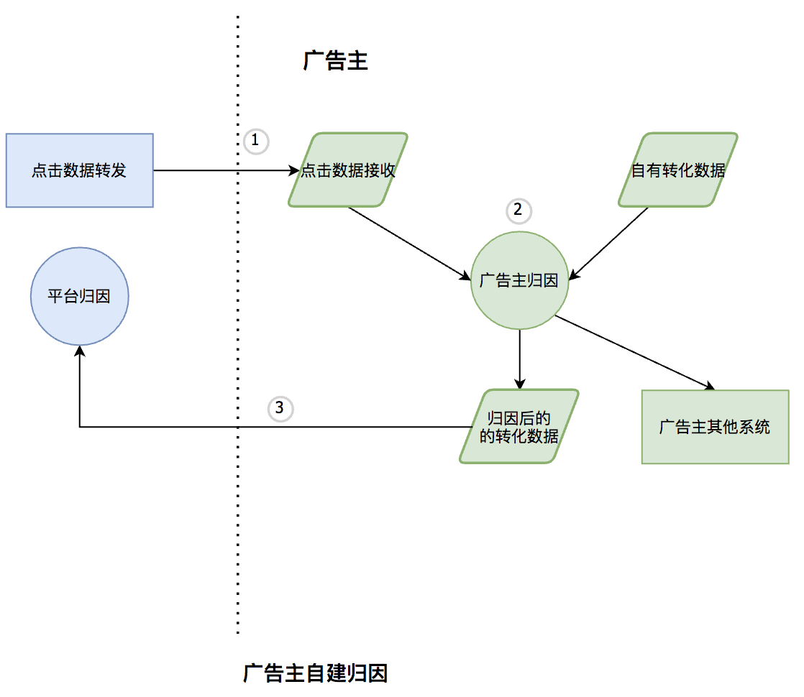
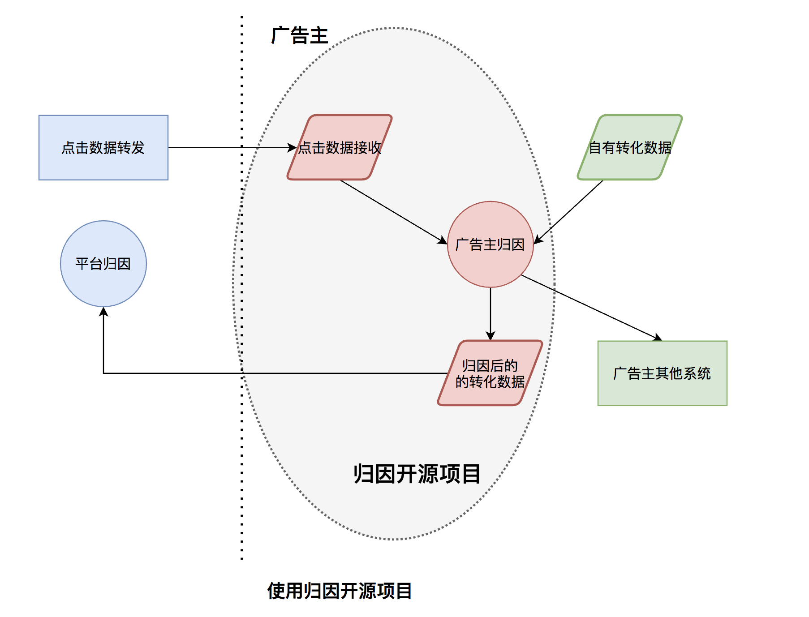

## Introduction


## Why

### 广告主自建归因Problem

假如是广告主自建归因，整体流程为




需要处理

- 点击数据接收
- 归因逻辑
- 归因后，上报属于对应广告平台的转化数据

这里面有几个问题

- 广告主归因逻辑和平台归因口径不一致，导致数据gap
- 广告主需要自建
  - 点击数据接收
  - 归因
  - 转化数据上报
- 点击数据和转化数据接口需要和平台一致，损耗人力，且难以保证时刻对齐


### 归因开源项目价值



广告主只需要处理转化数据，其他的逻辑有开源系统帮忙实现。且有以下优势

- 和AMS归因逻辑整体保持一致
- 开源项目支持在线server，离线batch两种方式，支持不同的场景


## Get Start

进入根目录，执行
```shell
make
```

默认执行归因example


## 归因整体逻辑

整体逻辑为：

- 用户ID体系
- 点击日志索引
- 归因
  - 点击日志匹配
  - 点击日志筛选
  - 点击日志排序


### 用户ID体系

根据AMS点击下发，支持这些[ID体系](https://git.code.oa.com/tssp/attribution/blob/master/internal/data/user_data.go)


### 点击日志索引

根据量级可以选用不同的存储，如hbase、ckv、local memory等，目前方便运行确定逻辑，使用的是local memory


### 归因匹配

根据转化数据，匹配最合适的点击

#### 点击日志匹配

根据点击日志索引，根据appid和用户id，匹配所有的点击日志


#### 点击日志过滤

这里实现了最普遍的策略

- 点击时间 < 转化时间
- 转化时间 - 点击事件 < 7天


#### 点击日志排序

AMS的实现包含了打分逻辑，不过按照开会讨论的结果，只需要按照点击时间排序，所以目前的逻辑是取最新的点击时间