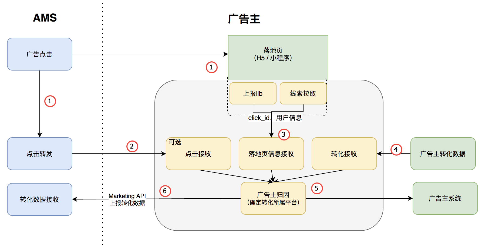
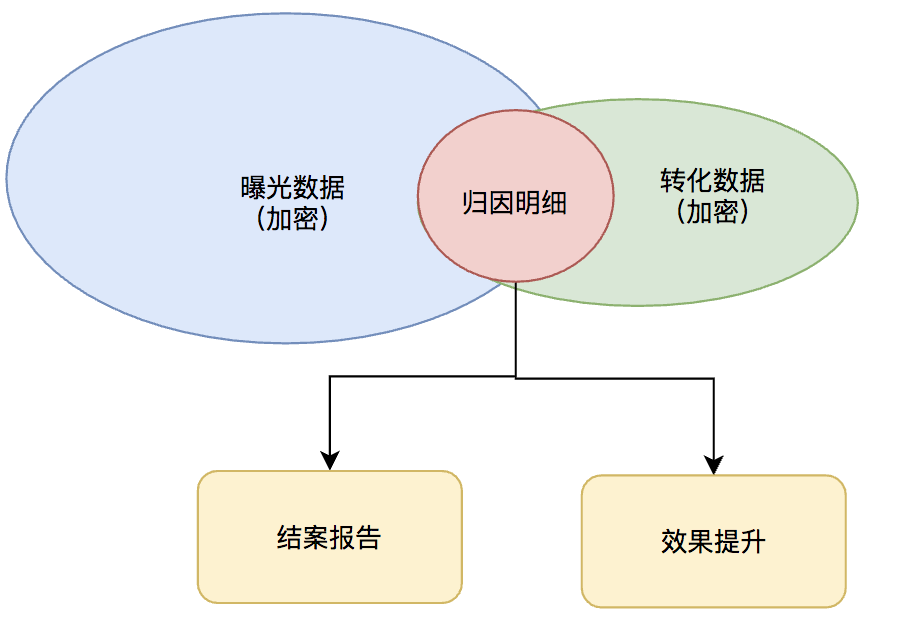
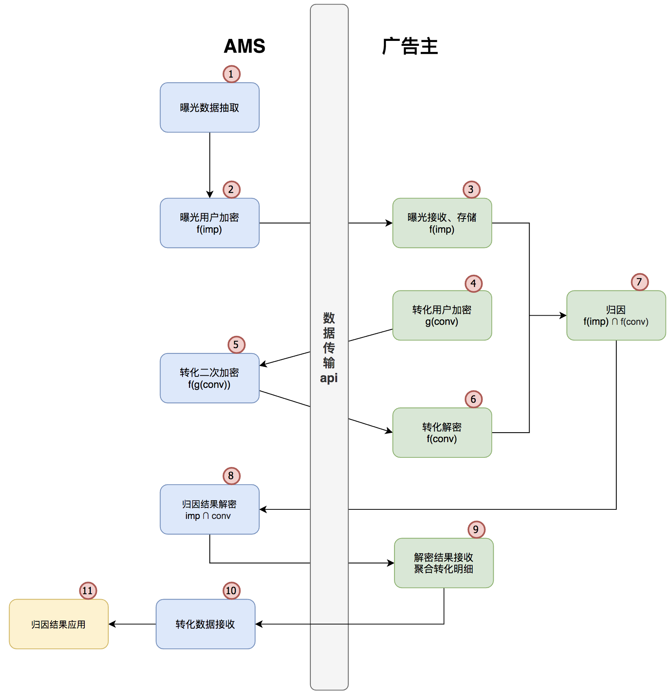

# Attribution

> 帮助广告主实现自归因，只需要简单的配置，就能快速使用。

## Overview



```shell
docker pull attribution:latest
docker run -d -p 9081:9081 attribution:latest -conv_parser_name=ams -click_parser_name=ams -attribution_result_storage=stdout -server_address=:9081 -v=50 -logtostderr
```

## 功能介绍

### 系统功能

- 点击数据接收
- 落地页数据接收
- 归因逻辑
- 归因后，上报对应平台的转化数据

#### Extra

- 和AMS归因逻辑整体保持一致
- 支持在线server，离线batch两种方式，支持不同的场景

## 点击归因整体逻辑

整体逻辑为：

- 用户ID体系
- 点击日志索引
- 归因
  - 点击日志匹配
  - 点击日志筛选
  - 点击日志排序

### 用户ID体系

根据AMS点击下发，支持这些[ID体系](https://github.com/TencentAd/attribution/blob/master/attribution/proto/user/user.proto#L8)

### 点击日志索引

根据量级可以选用不同的存储，如hbase、ckv、local memory等

### 归因匹配

根据转化数据，匹配最合适的点击

#### 点击日志匹配

根据点击日志索引，根据appid和用户id，匹配所有的点击日志

#### 点击日志过滤

这里实现了最普遍的策略

- 点击时间 < 转化时间
- 转化时间 - 点击事件 < x天

#### 点击日志排序

可以实现打分逻辑，目前只按照点击时间排序，所以目前的逻辑是取最新的点击时间

## 曝光归因

对于点击归因，品牌广告主只能了解从广告曝光后last click（平均大概2%的点击率）能影响到的转化，但忽略了98%的人群曝光的价值。曝光归因能触达更多的转化人群，一些广告主希望能通过曝光更好的衡量合约的“转化”效果

出于隐私保护，对于有标签的曝光数据，AMS不能提供给广告主。广告主也不希望把自己所有的转化数据传给广告平台。最终导致不能执行曝光归因。

这里提供一个方案，满足

- 数据加密，保证双方数据安全
- 基于曝光数据实现归因，平台拿到转化明细，用于合约结案报告和效果提升



方案不依赖渠道包，所以同时解决了android渠道包拦截，ios不能区分渠道包的问题。

同时，方案包含了广告主部分的建设，能让广告主更低成本，更自动地对接。

### **方案流程**



步骤说明：

1. AMS根据广告主推广计划进行曝光数据抽取
2. AMS将发生曝光的用户ID进行加密，得到f(imp)，然后根据配置的曝光转发地址发送给广告主（类似于点击转发）
3. 广告主接收到f(imp)后，把数据进行存储
4. 广告主对转化的用户ID进行加密，得到g(conv)，然后发送给AMS
5. AMS转化数据进行二次加密，得到f(g(conv))，然后发送给广告主
6. 广告主对二次加密的数据f(g(conv))进行解密，获得f(conv)
7. 广告主对f(imp) 和 f(conv) 进行归因逻辑处理，获取交集f(imp) ∩ f(conv)，并把结果传给AMS
8. AMS对交集结果进行解密，获取发生转化的原始用户ID，再把原始用户ID传给广告主
9. 广告主根据原始用户ID转化的明细信息（比如行为等），转发给AMS
10. AMS接收转化数据
11. 转化数据应用，如合约择优等。
