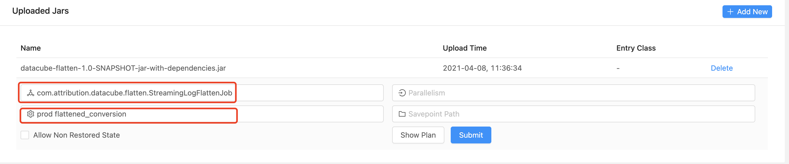

# README

## 项目的启动

### 项目打包

进入到项目的根目录，使用maven进行打包

```shell
mvn clean install
```

### 修改配置文件

在`datacube/datacube-flatten/src/main/resources/conv-flattened-streaming.conf`文件中修改相关的配置

配置文件中的第一级设置了什么环境，如`test`和`prod`

```json
prod {
    flattened_conversion {
        log-type: "conversion"
        saving-dir: "cosn://attribution-log-test-1257943044/conversion-test/"
        checkpoint-dir: "cosn://attribution-log-test-1257943044/checkpoint-test/"
        checkpoint-interval: "60000"
        stream-config {
            type: "kafka"
            bootstrap-servers: "9.134.188.241:9093"
            group-id: "test-consumer-group"
            topic: "conversion_test"
            pb-class-name: "com.tencent.attribution.proto.conv.Conv.ConversionLog"
        }
        stream-sink-config {
            bootstrap-servers: "9.134.188.241:9092"
            topic: "conversion_sink_test"
        }
    }
}
```

这里以``prod`环境为例，第二级为`flattened_conversion`，可以根据不同的用途进行命名设置

主要修改的位置如下：

- logtype：需要打平的对象类型， 可以是`click`和`conversion`
- saving-dir：打平之后的日志的存储文件路径
- checkpoint-dir： checkpoint保存的文件路径
- stream-config：数据源的相关配置
  - bootstrap-servers：kafka的服务器地址
  - topic：consumer的topic
  - pb-class-name：需要消费的数据的所属proto类型
- stream-sink-config：日志sink的相关配置
  - bootstrap-servers：kafka的服务器地址
  - topic：producer的topic

### 任务的执行

使用flink的可视化界面来部署任务并执行



这里上传了可执行jar包之后需要填入执行类的全限定名，还有运行参数，根据刚刚修改的配置文件，填入运行环境和运行的场景，比如`prod flattened_conversion`

然后提交任务即可运行任务
